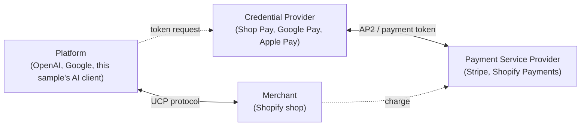
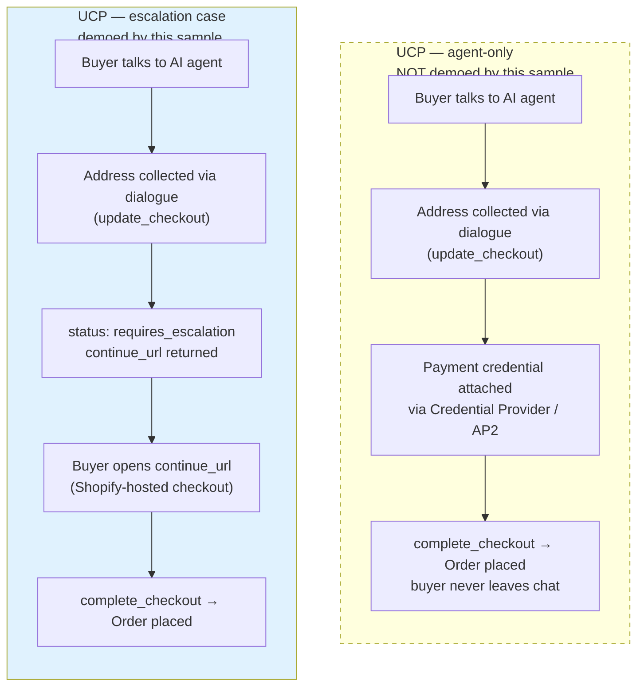
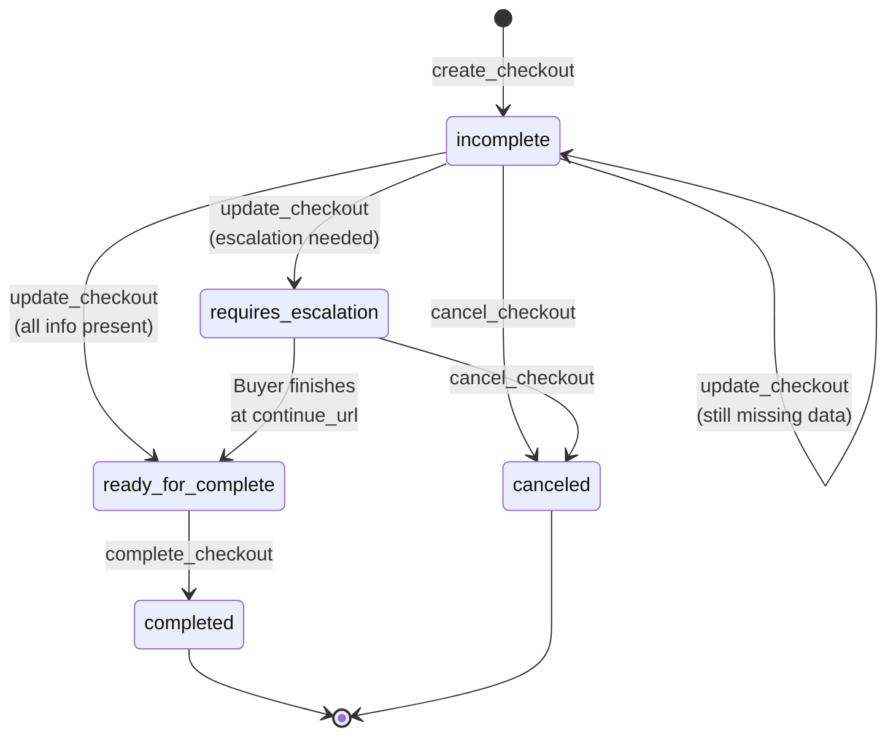
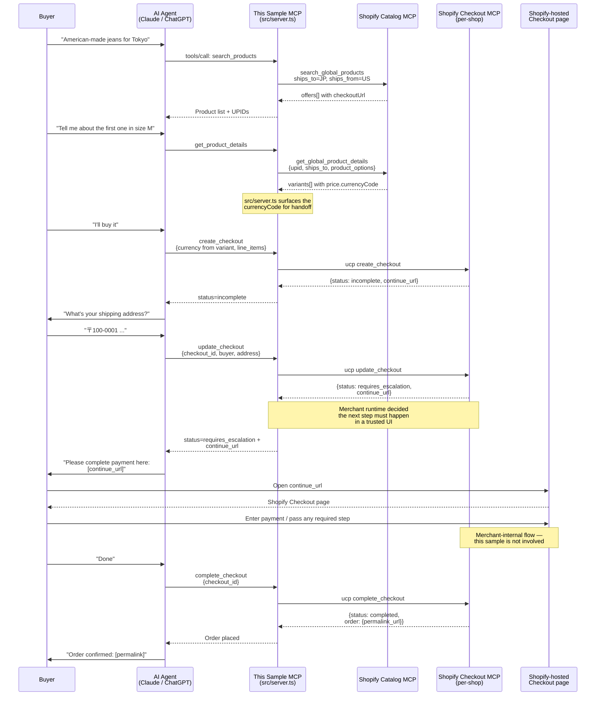

# UCP Escalation — Concept Map vs. This Sample

This document explains the **escalation** concept in [Shopify's Agentic Commerce / UCP stack](https://shopify.dev/docs/agents) and shows precisely how — and how far — this sample reproduces it. Use it together with [sequence-diagram.md](sequence-diagram.md) (which covers the wire-level flow) for a complete picture.

Everything below is derived from publicly available sources:

- [Shopify Agentic Commerce docs](https://shopify.dev/docs/agents)
- [Shopify Checkout MCP reference](https://shopify.dev/docs/agents/checkout/mcp)
- [Shopify ECP reference](https://shopify.dev/docs/agents/checkout/ecp)
- [UCP specification (ucp.dev)](https://ucp.dev/)
- [Building the Universal Commerce Protocol (Shopify Engineering)](https://shopify.engineering/ucp)
- [Under the Hood — UCP (Google Developers Blog)](https://developers.googleblog.com/under-the-hood-universal-commerce-protocol-ucp/)
- [How agentic commerce works (Shopify Blog)](https://www.shopify.com/blog/how-agentic-commerce-works)

## What "escalation" means in UCP

The UCP Checkout capability exposes a `status` field that the agent drives the conversation off. In the happy path, an agent can collect buyer information, attach a payment credential, and complete a purchase entirely through MCP calls. In other cases, the merchant needs the buyer in a trusted, merchant-hosted UI — to enter payment details, pass an issuer-driven authentication step, or satisfy merchant-configured requirements.

**Escalation** is the runtime signal that the agent should stop driving the flow alone and hand the buyer off. The Checkout MCP communicates this with `status: requires_escalation` and a `continue_url` the buyer (or agent host) opens to finish the transaction.

The decision whether to escalate is owned by the merchant's UCP backend at runtime; the public spec deliberately does not enumerate the specific signals, since they depend on payment method, merchant configuration, and risk evaluation. The contract for the agent is simple: read `status`, surface `continue_url` when it's `requires_escalation`, and proceed when it reaches `ready_for_complete`.

References:

- [Checkout MCP — status lifecycle](https://shopify.dev/docs/agents/checkout/mcp)
- [UCP shopping checkout spec](https://ucp.dev/)

## The four UCP actors

**This sample sits between Platform and Merchant.** It is a Remote MCP server that the Platform (an AI agent) connects to, and it speaks UCP to the Merchant (Shopify Catalog + Checkout MCP). The Credential Provider and PSP arms are **not represented** in this sample — buyers always escalate to Shopify-hosted checkout to enter payment.

Reference: [Google Developers Blog — UCP](https://developers.googleblog.com/under-the-hood-universal-commerce-protocol-ucp/) discusses these actor roles and how AP2 fits in.

## Two buyer UX modes — and which this sample demos

**Why mode A is not demoable here**: it requires integrating with a Credential Provider (e.g., Shop Pay account with a saved card, or Google Pay / Apple Pay token exchange via AP2). This sample's `create_checkout` does not supply a payment credential, so the merchant's runtime will route to mode B in practice.

Reference: [Shopify Checkout MCP — status lifecycle](https://shopify.dev/docs/agents/checkout/mcp), [Shopify Engineering: Building UCP](https://shopify.engineering/ucp) (handoff section).

## Status state machine

The Checkout MCP returns a `status` on every response, and the agent drives the flow off it. The diagram below is the canonical UCP state machine from the [Checkout MCP reference](https://shopify.dev/docs/agents/checkout/mcp); the right column shows which tool in this sample is called at each step.

In this sample:

- [src/server.ts](../src/server.ts) `create_checkout` initiates the session and returns the first status
- `update_checkout` advances `incomplete` → `requires_escalation` or `ready_for_complete`
- `complete_checkout` finalizes only when status is `ready_for_complete`
- Tool descriptions explicitly tell the AI agent to inspect `status` and show `continue_url` on `requires_escalation`

## Who decides what

UCP intentionally splits decision-making across actors. Roughly:

| Decision | Who decides | Public surface |
|---|---|---|
| Whether an AI channel can discover this merchant's products | Merchant | [Admin → Sales channels → Agentic](https://help.shopify.com/en/manual/online-sales-channels/agentic-storefronts) |
| Whether direct checkout is enabled per AI channel | Merchant | Same Admin section |
| Whether a UCP call returns `requires_escalation` | Merchant runtime | Returned in the Checkout MCP response |
| Whether to redirect to `continue_url` or embed via ECP | Agent / host | [ECP `ec_delegate` URL params](https://shopify.dev/docs/agents/checkout/ecp) |
| Final payment authorization, fraud check, fulfillment | Merchant / PSP | Out of the agent's hands once handed off |

**This sample only exercises the Agent column.** Merchant-side configuration (Agentic Storefronts admin), merchant runtime decisions, and PSP-side logic are all out of scope.

## How this sample wires the escalation flow

The diagram below traces a single buyer journey from search through escalation through order completion, annotated with the source files that implement each step.

Key implementation references:

- **Status-driven dispatch** lives in the AI's tool descriptions, not in code: see the `update_checkout` description in [src/server.ts](../src/server.ts) where the AI is told "if status is `requires_escalation`, show the `continue_url` to the buyer"
- **Fallback path** for non-UCP shops: `src/checkout.ts` resolves the Checkout MCP endpoint via `/.well-known/ucp`. When the manifest returns 404 (or has no `dev.ucp.shopping` MCP transport), `resolveCheckoutMcpUrl` throws `UcpNotSupportedError` — `create_checkout` catches it and tells the AI to use the Catalog MCP's `checkoutUrl` cart permalink instead. See the catch block in [src/server.ts](../src/server.ts) around the `UcpNotSupportedError` instance check.
- **continue_url decoration** appends `utm_source=ucp_demo_app` and `skip_shop_pay=true` so the buyer lands on the Shopify-hosted checkout with the prefilled address visible (and not on the Shop Pay OTP prompt) — see `decorateContinueUrl` in [src/server.ts](../src/server.ts).
- **Currency handoff** from `get_product_details` into `create_checkout` is documented in [tips.md §6](tips.md)

## What this sample deliberately does **not** demo

Be honest with viewers about scope:

| Concept | Demoed here? | Why not |
|---|---|---|
| UCP agent-only completion (buyer never leaves chat) | ❌ | Requires Credential Provider integration (Shop Pay / Google Pay / Apple Pay via AP2). Out of scope for a server-only MCP sample. |
| ECP — Embedded Checkout Protocol | ❌ | Requires a host app with WebView + JSON-RPC handlers. See [ECP docs](https://shopify.dev/docs/agents/checkout/ecp). |
| `ec_delegate` agent-side delegation | ❌ | Only relevant for ECP-embedded flows. See [ECP `ec_delegate`](https://shopify.dev/docs/agents/checkout/ecp). |
| Merchant Agentic Storefronts configuration | ❌ | Merchant Admin UI concern, not an MCP server concern. See [Agentic Storefronts admin docs](https://help.shopify.com/en/manual/online-sales-channels/agentic-storefronts). |
| Specific runtime escalation triggers | ❌ | Merchant-runtime decision; the public spec exposes the resulting `status` and `continue_url` but not the input signals. |

For these, follow the [UCP specification](https://ucp.dev/) and [Shopify Agentic Commerce docs](https://shopify.dev/docs/agents).

## References

- [UCP Specification](https://ucp.dev/) — full protocol, including the canonical status lifecycle
- [Shopify Agentic Commerce](https://shopify.dev/docs/agents) — developer landing page
- [Shopify Checkout MCP Reference](https://shopify.dev/docs/agents/checkout/mcp) — `create/update/complete_checkout` shapes
- [Shopify ECP Reference](https://shopify.dev/docs/agents/checkout/ecp) — the embedded alternative not demoed here
- [Shopify Engineering: Building UCP](https://shopify.engineering/ucp) — design rationale
- [How agentic commerce works (Shopify Blog)](https://www.shopify.com/blog/how-agentic-commerce-works) — eligibility, channel availability
- [Google Developers Blog — UCP](https://developers.googleblog.com/under-the-hood-universal-commerce-protocol-ucp/) — co-developer's perspective
- [Agentic Storefronts admin help](https://help.shopify.com/en/manual/online-sales-channels/agentic-storefronts) — merchant-side controls
- [sequence-diagram.md](sequence-diagram.md) — wire-level flow including auth and the initialize-skip optimization
- [tips.md](tips.md) — implementation-level best practices for Catalog / Checkout MCP integration
