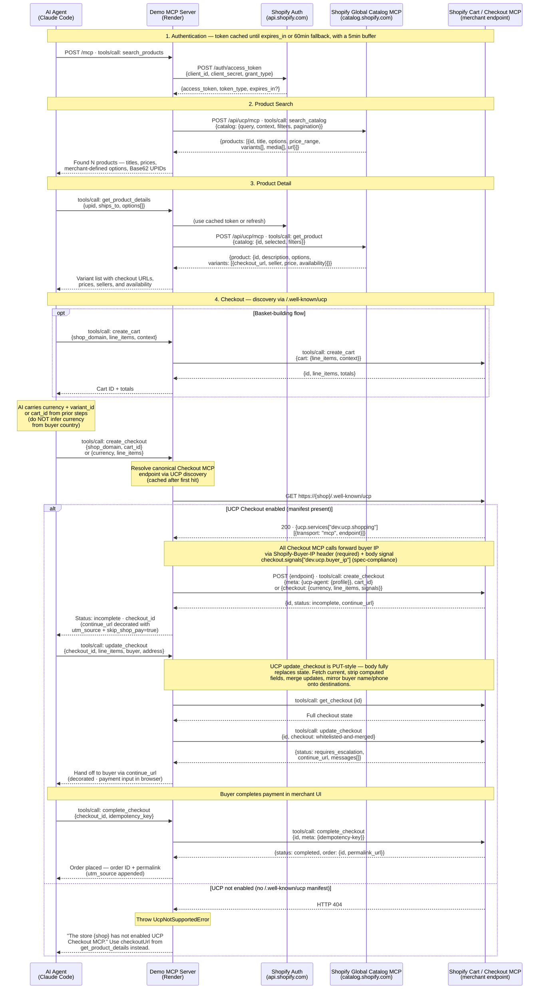

# Sequence Diagram — Shopify UCP Demo MCP

This diagram shows the full interaction flow between the AI Agent, Demo MCP Server, and Shopify's Catalog/Checkout APIs.



## Notes

### Token caching

The Demo MCP Server caches the bearer token from `api.shopify.com/auth/access_token` until `expires_in` when present, otherwise for Shopify's documented 60-minute expiry, with a 5-minute refresh buffer. If the cached token is still valid, the auth request is skipped on subsequent calls. The same token is used for Catalog, Cart, and Checkout MCP calls.

### Catalog MCP — no initialize handshake

Calls to the Global Catalog MCP go straight to `tools/call` with no prior `initialize` handshake. Skipping `initialize` halves the round-trips per user request in this sample.

### Dual response schema from Catalog MCP

Catalog responses may return per-shop offers as either:
- `products[]` / `product.products[]` — older schema (shop name, checkoutUrl, selectedProductVariant)
- `products[].variants[]` / `product.variants[]` — current schema (seller, checkout_url, price, availability)

The server handles both and extracts `checkoutUrl` / `checkout_url` from whichever is present.

### Checkout MCP discovery and fallback

The canonical Checkout MCP endpoint is discovered via the UCP manifest at `https://{shop}/.well-known/ucp` (see `src/checkout.ts` `resolveCheckoutMcpUrl`). The manifest is required because the Catalog MCP often surfaces a shop's public custom domain, while the actual `/api/ucp/mcp` route may live on a different `*.myshopify.com` host — only the manifest tells us the mapping. Resolved endpoints are cached in-process so repeat calls don't re-fetch.

If the manifest returns **HTTP 404** (or is missing the `dev.ucp.shopping` MCP transport), the server throws `UcpNotSupportedError` and the `create_checkout` tool responds with a buyer-facing message telling the AI to fall back to the standard `checkoutUrl` cart permalink from the Catalog MCP response.

### Buyer IP propagation

Shopify's Checkout MCP requires the `Shopify-Buyer-IP` HTTP header with a valid IPv4 or IPv6 address when calling tools that mutate cart state under a trusted authentication method — omitting it returns HTTP 422 with `Missing required buyer IP header.` (observed empirically). This server forwards the IP via the `Shopify-Buyer-IP` header **and** the UCP-spec body signal `checkout.signals["dev.ucp.buyer_ip"]` (the header is what Shopify currently enforces on; the body signal is kept for spec compliance and forward compatibility). The buyer IP comes from `req.ip` (Express `trust proxy` set so Render's `X-Forwarded-For` is honored) and is propagated through the request via `AsyncLocalStorage` in `src/request-context.ts`. In this Remote MCP topology the captured IP is the AI provider's, not the buyer's true client IP; production deployments serving real buyer traffic should pass the buyer's true IP.

### continue_url decoration

Before handing `continue_url` back to the AI, the server appends two query params:

- `utm_source=ucp_demo_app` — lets the merchant attribute traffic from this sample in their analytics.
- `skip_shop_pay=true` — community-verified workaround that disables Shopify's "auto Shop Pay login" default. Without it, when the buyer's email matches an existing Shop Pay account, the hosted checkout opens straight into an OTP prompt and ignores the address/buyer fields the agent already filled via `update_checkout`.

The receipt `permalink_url` returned on `status: completed` is similarly tagged with `utm_source` (no `skip_shop_pay` needed there).

### Checkout status flow

```
create_checkout
    ↓
status: incomplete       → update_checkout (add missing buyer/address info)
    ↓
status: requires_escalation → show continue_url to buyer (payment UI)
    ↓
status: ready_for_complete  → complete_checkout
    ↓
status: completed ✓
```
