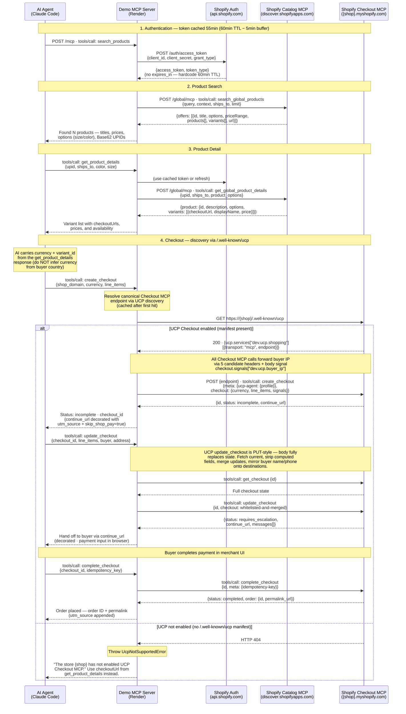

# Sequence Diagram — Shopify UCP Demo MCP

This diagram shows the full interaction flow between the AI Agent, Demo MCP Server, and Shopify's Catalog/Checkout APIs.



## Notes

### Token caching

The Demo MCP Server caches the bearer token from `api.shopify.com/auth/access_token` for 55 minutes (5-minute buffer before the documented 60-minute expiry). The `/auth/access_token` response does not include an `expires_in` field — measured 2026-05-19, response keys are only `[access_token, token_type]` — so the TTL is hardcoded against Shopify's documented value. If the cached token is still valid, the auth request is skipped on subsequent calls. The same token is used for both the Catalog MCP and the Checkout MCP.

### Catalog MCP — no initialize handshake

Calls to the Catalog MCP go straight to `tools/call` with no prior `initialize` handshake. Measured 2026-05-19: `tools/call` returns HTTP 200 in ~390ms with no `mcp-session-id` header issued or required. Skipping `initialize` halves the round-trips per user request.

### Dual response schema from Catalog MCP

`get_global_product_details` may return per-shop offers as either:
- `product.products[]` — documented schema (shop name, checkoutUrl, selectedProductVariant)
- `product.variants[]` — alternate schema observed in practice (displayName, checkoutUrl, price)

The server handles both and extracts `checkoutUrl` from whichever is present.

### Checkout MCP discovery and fallback

The canonical Checkout MCP endpoint is discovered via the UCP manifest at `https://{shop}/.well-known/ucp` (see `src/checkout.ts` `resolveCheckoutMcpUrl`). The manifest is required because the Catalog MCP often surfaces a shop's public custom domain (e.g. `pojstudio.com`), while the actual `/api/ucp/mcp` route lives on the `*.myshopify.com` host — only the manifest tells us the mapping. Resolved endpoints are cached in-process so repeat calls don't re-fetch.

If the manifest returns **HTTP 404** (or is missing the `dev.ucp.shopping` MCP transport), the server throws `UcpNotSupportedError` and the `create_checkout` tool responds with a buyer-facing message telling the AI to fall back to the standard `checkoutUrl` cart permalink from the Catalog MCP response.

### Buyer IP propagation

Shopify's Checkout MCP rejects `create_checkout` with `AuthenticationFailed: Missing required buyer IP header.` if the caller doesn't forward the buyer's IP. The exact field name isn't documented, so this server sends every plausible candidate at once: HTTP headers `Shopify-Storefront-Buyer-IP`, `Shopify-Buyer-IP`, `X-Forwarded-For`, `X-Real-IP`, `Buyer-IP`, **and** the UCP-spec body signal `checkout.signals["dev.ucp.buyer_ip"]`. The buyer IP comes from `req.ip` (Express `trust proxy` set so Render's `X-Forwarded-For` is honored) and is propagated through the request via `AsyncLocalStorage` in `src/request-context.ts`.

### continue_url decoration

Before handing `continue_url` back to the AI, the server appends two query params:

- `utm_source=ucp_demo_app` — lets the merchant attribute traffic from this sample in their analytics.
- `skip_shop_pay=true` — community-verified workaround that disables Shopify's "auto Shop Pay login" default. Without it, when the buyer's email matches an existing Shop Pay account, the hosted checkout opens straight into an OTP prompt and ignores the address/buyer fields the agent already filled via `update_checkout`.

The receipt `permalink_url` returned on `status: completed` is similarly tagged with `utm_source` (no `skip_shop_pay` needed there).

### Checkout status flow

```
create_checkout
    ↓
status: incomplete       → update_checkout (add missing buyer/address info)
    ↓
status: requires_escalation → show continue_url to buyer (payment UI)
    ↓
status: ready_for_complete  → complete_checkout
    ↓
status: completed ✓
```
