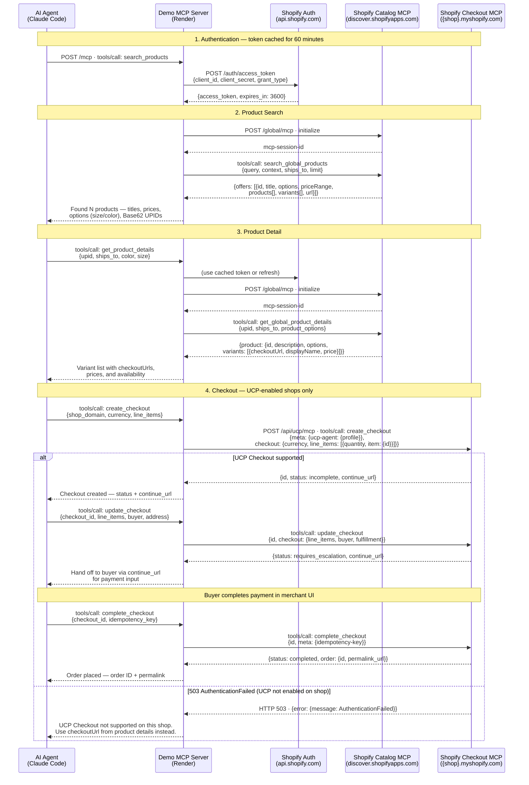

# Sequence Diagram — Shopify UCP Demo MCP

This diagram shows the full interaction flow between the AI Agent, Demo MCP Server, and Shopify's Catalog/Checkout APIs.



## Notes

### Token caching

The Demo MCP Server caches the bearer token from `api.shopify.com/auth/access_token` for up to 55 minutes (5-minute buffer before the 60-minute expiry). If the cached token is still valid, the auth request is skipped on subsequent calls.

### Catalog MCP session

Each call to the Catalog MCP (`search_global_products`, `get_global_product_details`) starts with an MCP `initialize` handshake. If the server returns an `mcp-session-id` header, subsequent requests in that call include it. The server is stateless — no session is persisted across user requests.

### Dual response schema from Catalog MCP

`get_global_product_details` may return per-shop offers as either:
- `product.products[]` — documented schema (shop name, checkoutUrl, selectedProductVariant)
- `product.variants[]` — alternate schema observed in practice (displayName, checkoutUrl, price)

The server handles both and extracts `checkoutUrl` from whichever is present.

### Checkout MCP fallback

The Checkout MCP endpoint (`https://{shop}.myshopify.com/api/ucp/mcp`) is only available on shops that have enabled UCP. If the call returns HTTP 503 / `AuthenticationFailed`, the server catches this and returns the cart permalink (`checkoutUrl`) from the Catalog MCP response as a direct fallback link.

### Checkout status flow

```
create_checkout
    ↓
status: incomplete       → update_checkout (add missing buyer/address info)
    ↓
status: requires_escalation → show continue_url to buyer (payment UI)
    ↓
status: ready_for_complete  → complete_checkout
    ↓
status: completed ✓
```
