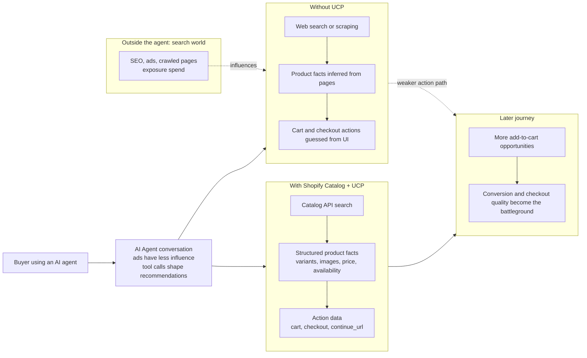

# Tips & Best Practices — Shopify UCP Demo MCP

This document covers implementation tips for getting better results from the Shopify Catalog and Checkout MCPs. All of these are implemented in this sample repository and can be used as a reference for your own UCP agent.

## 1. Combine `ships_to` and `ships_from` for origin-specific queries

`ships_to` alone filters to stores that ship to the buyer's country. For queries that mention a product origin (e.g. "American-made jeans", "Japanese skincare"), also pass `ships_from` to narrow results to stores that ship *from* that origin country.

| Query | `ships_to` | `ships_from` |
|---|---|---|
| American-made jeans available in Tokyo | `JP` | `US` |
| Japanese traditional goods in the US | `US` | `JP` |
| Italian leather bags shipping to France | `FR` | `IT` |

```json
{
  "name": "search_catalog",
  "arguments": {
    "catalog": {
      "query": "American-made denim jeans",
      "context": {
        "intent": "buyer in Tokyo looking for authentic US denim brands",
        "address_country": "JP"
      },
      "filters": {
        "ships_to": { "country": "JP" },
        "ships_from": [{ "country": "US" }]
      }
    }
  }
}
```

Using only `ships_to: "JP"` would return any store worldwide that ships to Japan. Adding `ships_from: "US"` restricts results to US-based stores shipping to Japan — far more relevant for origin-specific queries.

## 2. Write rich `context` — it is marked "critical" in the Catalog MCP spec

The `context` parameter has a significant impact on result quality. Shopify's Catalog MCP documentation marks it as **Required (critical)**. A detailed context helps the AI and the Catalog engine surface more relevant products.

**Poor context:**
```
"buyer in Japan"
```

**Rich context:**
```
"buyer in Tokyo, Japan looking for authentic American-made premium denim jeans,
prefers well-known US brands, quality over price, ships from US to JP"
```

Always include:
- Buyer's location (city and country)
- Product origin if mentioned in the query
- Style or quality preferences
- Brand expectations (premium, budget, specific brands)
- Any other details from the conversation

## 3. Use image similarity when the buyer provides a product photo

Shopify Global Catalog supports similarity search by passing an image in the
`like` array. This sample exposes that as `image_base64` and
`image_content_type` on `search_products`. It also accepts `image_url` as a
client-compatibility fallback, then fetches and encodes the image server-side.
The upstream Catalog request uses `catalog.like`:

```json
{
  "name": "search_catalog",
  "arguments": {
    "catalog": {
      "query": "similar jacket in natural fabric",
      "context": {
        "intent": "buyer in California looking for a visually similar jacket that ships within the US",
        "address_country": "US"
      },
      "like": [{
        "image": {
          "content_type": "image/jpeg",
          "data": "<raw-base64-image-data>"
        }
      }],
      "filters": {
        "ships_to": { "country": "US" },
        "available": true
      }
    }
  }
}
```

Use both `query` and `image_base64` when the buyer wants a visual match with
specific constraints such as material, budget, size, or destination. Use
`image_base64` without `query` only when the buyer asks for a pure visual
similarity search.

Validate that the client sent the actual image bytes, not a placeholder or
caption. This sample rejects decoded image payloads smaller than 512 bytes and
times out Catalog calls after 30 seconds by default (`CATALOG_MCP_TIMEOUT_MS`)
so the AI client receives a clear tool error instead of waiting indefinitely.

## 4. Show product ratings to help buyers choose

The `search_catalog` response may include `rating: { value, count }` at both the product level and the per-seller variant level. Surface this in your UI when present so buyers can prioritize highly rated products.

```json
// In the search response:
{
  "products": [{
    "title": "Levi's 501 Original Jeans",
    "rating": { "value": 4.8, "count": 312 },
    "variants": [{
      "rating": { "value": 4.9, "count": 87 },
      ...
    }]
  }]
}
```

This sample server displays ratings inline in search results:
```
1. **Levi's 501 Original Jeans** — 89.00 USD  rating 4.8 (312)
```

## 5. Use pagination limit and minor-unit price filters

The latest Catalog MCP request shape puts result count under
`catalog.pagination.limit` and price filters under `catalog.filters.price`.
Amounts are minor currency units: `15000` means $150.00 USD.

If you need fresh variant-level detail for a specific product, call
`get_product` with the product ID and selected option labels.

This sample also supports a saved Catalog default. When
`SHOPIFY_CATALOG_ID` is set, `search_products` sends its value as
`catalog.saved_catalog_slug`; the saved Catalog's inputs and overrides take
precedence over runtime search filters. When it is unset, searches use the
default Global Catalog across eligible merchants. Despite the environment
variable name, the value is a saved Catalog slug from the Dev Dashboard, not a
Shopify GID.

## 6. Discover Checkout MCP via /.well-known/ucp and fall back gracefully

Not every Shopify store has enabled the UCP Checkout MCP. The UCP spec defines `https://{shop}/.well-known/ucp` as the discovery document — fetch it once per shop and read `ucp.services["dev.ucp.shopping"][].endpoint` to find the canonical Checkout MCP URL. This matters because the Catalog MCP usually surfaces the shop's public custom domain, while the actual `/api/ucp/mcp` route may live on a different `*.myshopify.com` host — only the manifest tells you the mapping.

When the manifest returns **HTTP 404** (or omits the `dev.ucp.shopping` MCP transport), treat it as a clear "UCP not enabled on this shop" signal. Throw a typed error (see `UcpNotSupportedError` in [src/checkout.ts](../src/checkout.ts)) so the caller can catch it and fall back to the `checkoutUrl` cart permalink from the Catalog MCP response.

```
/.well-known/ucp present     →  create_checkout → update_checkout → continue_url
/.well-known/ucp returns 404 →  show checkoutUrl from search/detail results
```

The `checkoutUrl` is a standard Shopify cart permalink that works for all stores, regardless of UCP support:
```
https://store.myshopify.com/cart/VARIANT_ID:QUANTITY?_gsid=...
```

Two practical refinements this sample uses:

- **In-process cache** the resolved endpoint per shop — shops rarely change their UCP routing and discovery shouldn't be re-fetched on every checkout call.
- **Short timeout (5s) on the manifest fetch** with a degraded fallback to the naive `*.myshopify.com/api/ucp/mcp` heuristic on network errors, so a flaky DNS lookup doesn't take the whole checkout flow down. A genuine 404 still throws `UcpNotSupportedError`.

## 7. Carry currency from product details into checkout

The `currency` argument for `create_checkout` must match the **merchant's pricing currency**, not the buyer's country. A US-based store can sell to a JP buyer but may only price and accept payment in USD — passing `JPY` in that case will fail. Take the currency directly from the offer returned by `get_product_details`:

```json
// In the get_product_details response:
{
  "products": [{
    "price": { "amount": "59.00", "currencyCode": "USD" },
    "checkoutUrl": "..."
  }]
}
```

```json
// Pass that currency through to create_checkout:
{
  "name": "create_checkout",
  "arguments": {
    "shop_domain": "store.myshopify.com",
    "currency": "USD",
    "line_items": [{ "variant_id": "...", "quantity": 1 }]
  }
}
```

This sample server's `create_checkout` tool description tells the AI explicitly: *"Pass the currency shown for the selected offer in the preceding get_product_details output. Do NOT infer from the buyer's country."* The sequence diagram in [sequence-diagram.md](sequence-diagram.md) also marks this handoff.

## 8. Token caching — honor `expires_in` with a fallback

The bearer token from `api.shopify.com/auth/access_token` is documented as valid for 60 minutes. Some responses include `expires_in`; older responses may omit it. Use `expires_in` when present and fall back to the documented 60-minute TTL.

Refresh with a 5-minute buffer:

```ts
const TOKEN_TTL_MS = 60 * 60 * 1000;
const EXPIRY_BUFFER_MS = 5 * 60 * 1000;

// On successful fetch:
tokenExpiresAt = Date.now() + (data.expires_in ? data.expires_in * 1000 : TOKEN_TTL_MS);

// On every getBearerToken() call:
if (cachedToken && Date.now() < tokenExpiresAt - EXPIRY_BUFFER_MS) {
  return cachedToken;
}
```

The same token is used for Catalog, Cart, and Checkout MCP calls — no separate credentials are needed.

## 9. Skip the Catalog MCP `initialize` handshake

The MCP spec describes an `initialize` request that returns an `mcp-session-id` header used by subsequent `tools/call` requests. The Global Catalog MCP accepts `tools/call` **directly** with no prior `initialize` in this sample's usage.

Sending `initialize` first doubles the round-trips for every search and detail call without any functional benefit. Go straight to `tools/call`:

```ts
const response = await fetch(CATALOG_MCP_URL, {
  method: 'POST',
  headers: {
    'Content-Type': 'application/json',
    Accept: 'application/json, text/event-stream',
    Authorization: `Bearer ${token}`,
  },
  body: JSON.stringify({
    jsonrpc: '2.0',
    method: 'tools/call',
    params: { name: 'search_catalog', arguments: { ... } },
    id: 1,
  }),
});
```

## 10. Preserve complete Catalog data for agent reasoning

Catalog results serve two different audiences. Buyers need a concise,
readable answer, while agents need the full structured response to compare
products and choose the correct next action.

Return both MCP result forms instead of flattening the Catalog response into
text only:

```ts
return {
  content: [{ type: 'text', text: conciseBuyerFacingSummary }],
  structuredContent: completeCatalogResult,
};
```

This sample preserves the complete `dev.shopify.catalog.global` response in
`structuredContent`, including `metadata.attributes`,
`metadata.top_features`, `metadata.unique_selling_points`, `condition`,
`eligible.native_checkout`, `availability.running_low`, `requires`, and
seller links. The text response remains compact for mobile clients.

Do not confuse display reduction with data reduction. Limiting the number of
search results is useful, but removing fields from products already returned
can prevent the agent from explaining recommendations, detecting checkout
eligibility, or respecting purchase prerequisites.

## 11. Web Search vs UCP Search

Without UCP, AI product discovery usually starts with web search or web
scraping. The agent meets pages that a search engine already crawled, so product
facts can be stale, incomplete, or optimized for human browsing rather than
machine action. Even if one store adds a UCP profile at its root, an AI agent is
not guaranteed to inspect that profile during broad product discovery; it may
only reach the store directly after web search has already selected that result.

Shopify Catalog changes the first step. Instead of asking a search engine for
pages, the agent can call a Catalog API for commerce data: products, images,
variants, prices, availability, shipping context, and checkout URLs. That gives
AI agents a fresher and more actionable product surface, especially for facts
that are hard to rank through web search snippets.

UCP also exposes the next actions after discovery. Web search can point to a
page, but it does not reliably tell an agent how to add the item to a cart,
which buyer information is required, or when to hand the buyer to checkout. UCP
responses can describe cart, checkout, status, and `continue_url` handoff steps
as structured data.

The commercial implication is that the place of competition can move. In the
human-search era, merchants spent heavily to win discovery through ads, SEO, and
reach. In the agentic-commerce era, the buyer is inside a conversation where ad
influence is weaker and the agent needs structured evidence to choose. This
shifts investment from paying only for exposure toward making products
machine-readable, easy to add to cart, and trustworthy to complete at checkout.



| Question | Web search / scraping | Shopify Catalog + UCP |
|---|---|---|
| What does the AI search first? | Crawled web pages selected by a search engine | Commerce data returned by Catalog |
| How fresh is the data? | Depends on crawl timing and page parsing | Designed to surface current product and offer details |
| Will store-level UCP support be noticed? | Not guaranteed during broad web search | Catalog and UCP are part of the agent's commerce path |
| Are variants, inventory, and shipping fit visible? | Often hidden, stale, or hard to infer | Returned as structured product and offer data |
| Can the AI take the next purchase action? | It has to inspect pages and guess buttons or forms | UCP exposes cart, checkout, status, and handoff steps |
| Where does investment move? | Toward exposure, SEO, and ad reach | Toward structured data, cart readiness, and checkout conversion |

## References

- [Global Catalog MCP](https://shopify.dev/docs/agents/catalog/global-catalog)
- [Global Catalog extension](https://shopify.dev/docs/agents/catalog/global-catalog-extension)
- [Cart MCP](https://shopify.dev/docs/agents/carts-and-checkout/cart-mcp)
- [Checkout MCP](https://shopify.dev/docs/agents/carts-and-checkout/checkout-mcp)
- [About Shopify Catalog](https://shopify.dev/docs/agents/catalog)
- [Universal Commerce Protocol](https://ucp.dev)
